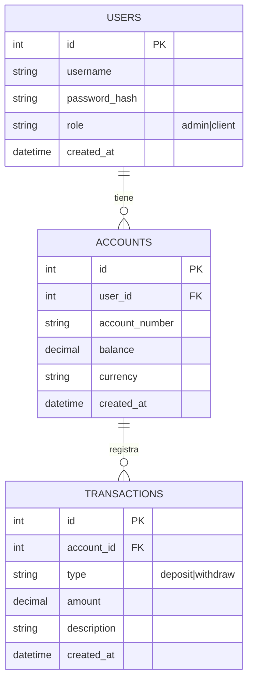
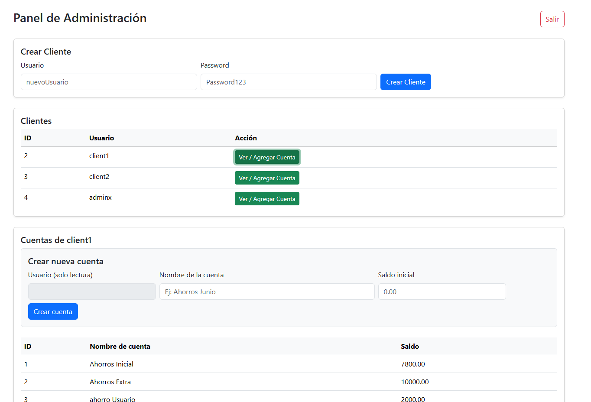
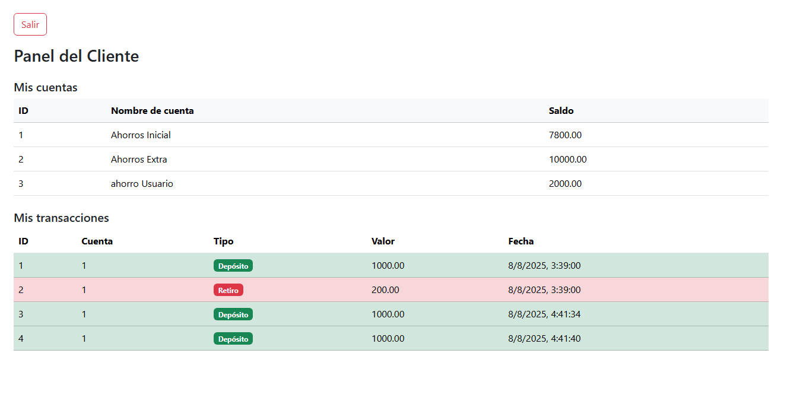

# Ahorros Fintech — Guía simple (para no ingenieros)

> **Qué es:** Una app para ver y mover ahorros. Tiene dos partes: **Pantalla web (React)** y **Servicio (FastAPI)**. Vive en un computador en la nube (**AWS EC2**).  
> **Objetivo:** que funcione en internet y que **se pueda actualizar fácil** sin romper nada.

---

## 1) Cómo se ve el sistema (dibujos)

### 1.1 Mapa general
```mermaid
flowchart LR
  Dev[Computador del desarrollador] -- "git push" --> Repo[(Repositorio GitHub)]
  Repo -- "opcional: CI/CD" --> EC2[(Servidor en AWS EC2)]

  subgraph EC2Cluster[EC2]
    direction TB
    NGINX[Nginx (recibe las visitas)] -- "/api" --> Uvicorn[Uvicorn + FastAPI (servicio)]
    NGINX -- "/" --> ReactBuild[Página web (React, archivos estáticos)]
    DB[(Archivo ahorros.db — SQLite)]
  end

  classDef infra fill:#eef,stroke:#555,stroke-width:1px;
  class EC2,Repo,Dev infra;
```

> Nota: Antes daba error porque el **nombre del subgraph `EC2` chocaba con el nodo `EC2`**. Lo cambiamos a `EC2Cluster[EC2]` y listo.

### 1.2 Modelo de datos (muy sencillo)


---

## 2) Qué hace cada parte (en palabras simples)

- **Página web (React):** lo que ve la persona (formularios, botones, tablas).
- **Servicio (FastAPI):** recibe pedidos de la página (por ejemplo “depositar 50.000”), valida y guarda en la base.
- **Nginx:** es el portero. Si alguien entra a `/`, entrega la página. Si entra a `/api`, envía la petición al servicio.
- **Base (SQLite):** un **archivo** (`ahorros.db`) donde se guardan los datos.

---

## 3) Cómo entrar y probar

- **Sitio web:** `http://<IP-del-EC2>/`
- **Manual del servicio (Swagger):** `http://<IP-del-EC2>/api/docs`

**Usuarios de ejemplo (semilla):**  
- Admin: `admin` / `Admin123`  
- Cliente: `client1` / `Client123`

> Estos usuarios se crean al correr el archivo de “semilla” (seed).

---

## 4) Cómo se actualiza sin complicarse (redeploy)

- **Si se usa Docker Compose:**  
  En el servidor (EC2), dentro de la carpeta del proyecto:
  ```bash
  git pull
  docker compose up -d --build
  ```

- **Si NO usa Docker (modo manual):**
  ```bash
  # backend
  cd backend && source venv/bin/activate
  pip install -r requirements.txt
  deactivate && sudo systemctl restart uvicorn

  # frontend
  cd ../frontend && npm install && npm run build
  sudo systemctl restart nginx
  ```

> **Demostración rápida:** cambie un texto visible en el frontend, haga `git push`, y ejecute los comandos de arriba. Refresque la página: debe verse el cambio.

---

## 5) Problemas típicos y soluciones rápidas

- **La página muestra error 502 (Bad Gateway):** el servicio puede estar apagado. Revíselo con  
  ```bash
  sudo systemctl status uvicorn
  ```
- **No carga el sitio:** Nginx puede estar apagado:  
  ```bash
  sudo systemctl status nginx
  ```
- **El puerto 80 está ocupado:** si usó Docker y también Nginx del sistema, apague uno de los dos.

---

## 6) Imágenes (coloca las tuyas)

- **Dashboard Admin**  
  

- **Dashboard Cliente**  
  

- **Swagger**  
  

---

## 7) ¿Qué hay en los ZIP que compartiste? (resumen rápido)

```
{
  "ahorro_app.zip": {
    "folder": "/mnt/data/ahorro_app",
    "sample_files": [
      "ahorros.db",
      "docker-compose.yml",
      "README.md",
      "requirements.txt",
      ".dockerignore",
      ".env",
      ".gitignore"
    ]
  },
  "frontend.zip": {
    "folder": "/mnt/data/frontend",
    "sample_files": [
      ".env",
      ".env.development",
      ".env.production",
      ".gitignore",
      "Dockerfile",
      "nginx.conf",
      "package.json",
      "package-lock.json"
    ]
  }
}
```
