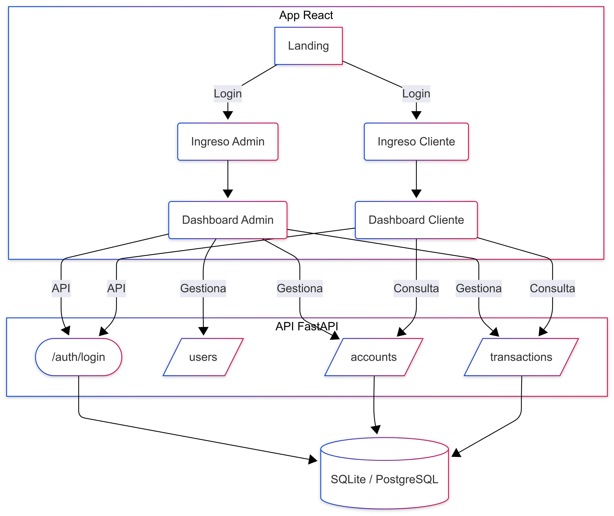
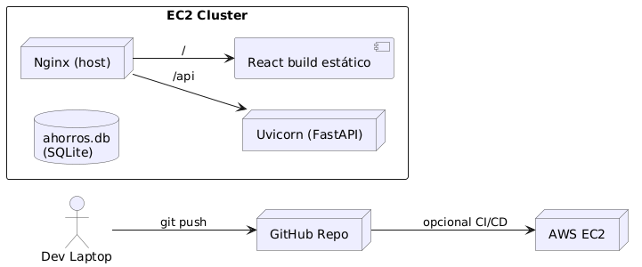

# Aplicación de # Ahorros Fintech – Guía rápida (Local, Pruebas y CI)


[](https://github.com/juancjaramillo/Ahorros_Fintech/actions/workflows/backend.yml)
[](https://github.com/juancjaramillo/Ahorros_Fintech/actions/workflows/frontend.yml)


> **Qué es:** Una app para ver y mover ahorros. Dos piezas: **Página Web (React)** y **Servicio (FastAPI)** en un servidor de **AWS EC2**.  
> **Objetivo de la prueba:** que funcione en internet y que **se pueda actualizar fácil** (“redeploy”).  


---

## Índice
- [Visión general](#visión-general)
- [Arquitectura](#arquitectura)
  - [Diagrama de alto nivel ](#diagrama-de-alto-nivel-imagen)
  - [Diagrama de despliegue ](#diagrama-de-despliegue)
- [Estructura del proyecto](#estructura-del-proyecto)
- [Diseño de base de datos](#diseño-de-base-de-datos)
  - [ERD](#erd-mermaid)
  - [DDL de referencia](#ddl-de-referencia)
- [API (endpoints principales)](#api-endpoints-principales)
- [Variables de entorno](#variables-de-entorno)
- [Instalación y desarrollo local](#instalación-y-desarrollo-local)
- [Despliegue en AWS](#despliegue-en-aws)
  - [Modo A · Manual](#modo-a--manual)
  - [Modo B · Docker Compose (rápido)](#modo-b--docker-compose-rápido)
- [Redeploy (actualizar versión rápido)](#redeploy-actualizar-versión-rápido)
- [Solución de problemas](#solución-de-problemas)
- [Capturas (placeholders)](#capturas-placeholders)
- [Licencia](#licencia)

---

## Visión general
La aplicación permite **crear cuentas de ahorro**, **depositar**, **retirar** y **consultar movimientos**.  
- **Admin:** gestiona usuarios y cuentas, ve todas las transacciones.  
- **Cliente:** ve sus cuentas, depositos y retiros.

---

## Arquitectura

### Diagrama de alto nivel 



### Diagrama de despliegue
 


---

## Estructura del proyecto

```
Ahorros_Fintech/
├─ backend/
│  ├─ main.py
│  ├─ routers/
│  │  ├─ account.py
│  │  ├─ user.py
│  │  └─ transaction.py
│  ├─ models.py
│  ├─ db.py
│  ├─ seed.py
│  ├─ requirements.txt
│  └─ .env
├─ frontend/
│  ├─ src/
│  │  ├─ components/
│  │  │  └─ AdminLogin.js
│  │  └─ ...
│  ├─ package.json
│  └─ .env.production
├─ docker-compose.yml        # Despliegue con Docker
└─ README.md
```

---

## Diseño de base de datos

### ERD 


### DDL de referencia
> Tabla de ejemplo para SQLite/Postgres.

```sql
CREATE TABLE users (
  id INTEGER PRIMARY KEY AUTOINCREMENT,
  username TEXT NOT NULL UNIQUE,
  password_hash TEXT NOT NULL,
  role TEXT NOT NULL CHECK(role IN ('admin','client')),
  created_at DATETIME DEFAULT CURRENT_TIMESTAMP
);

CREATE TABLE accounts (
  id INTEGER PRIMARY KEY AUTOINCREMENT,
  user_id INTEGER NOT NULL,
  account_number TEXT NOT NULL UNIQUE,
  balance NUMERIC NOT NULL DEFAULT 0,
  currency TEXT NOT NULL DEFAULT 'COP',
  created_at DATETIME DEFAULT CURRENT_TIMESTAMP
);

CREATE TABLE transactions (
  id INTEGER PRIMARY KEY AUTOINCREMENT,
  account_id INTEGER NOT NULL,
  type TEXT NOT NULL CHECK(type IN ('deposit','withdraw')),
  amount NUMERIC NOT NULL CHECK(amount >= 0),
  description TEXT,
  created_at DATETIME DEFAULT CURRENT_TIMESTAMP
);
```

---

## API (endpoints principales)

| Método | Ruta | Descripción | Rol |
|---|---|---|---|
| POST | `/auth/login` | Autenticación (token) | Todos |
| GET  | `/users/` | Lista usuarios | Admin |
| POST | `/users/` | Crea usuario | Admin |
| GET  | `/accounts/` | Lista cuentas (admin) / propias (cliente) | Admin/Cliente |
| POST | `/accounts/` | Crea cuenta | Admin |
| GET  | `/transactions/` | Lista transacciones (por cuenta) | Admin/Cliente |
| POST | `/transactions/deposit` | Depósito | Admin/Cliente |
| POST | `/transactions/withdraw` | Retiro | Admin/Cliente |

**Usuarios de ejemplo (seed):**
- Admin: `admin` / `admin123`
- Cliente: `client1` / `client123`

---

## Variables de entorno

**Backend (`backend/.env`):**
```ini
DATABASE_URL=sqlite:////home/ubuntu/Ahorros_Fintech/ahorros.db
SECRET_KEY=<tu llave>
ALGORITHM=HS256
ACCESS_TOKEN_EXPIRE_MINUTES=60
```

**Frontend (`frontend/.env.production`):**
```ini
REACT_APP_API_URL=/api
```

---

## Instalación y desarrollo local

```bash
# Backend
cd backend
python -m venv venv
# Linux/Mac
source venv/bin/activate
# Windows (PowerShell): .env\Scripts\Activate.ps1

pip install --upgrade pip
pip install -r requirements.txt
uvicorn main:app --reload --host 0.0.0.0 --port 8000

# Frontend
cd ../frontend
npm install
npm start   # abre http://localhost:3000
```

**Seed (crear datos de prueba):**
```bash
# estando en backend con el venv activado
python seed.py
```

---

## Despliegue en AWS

> La IP pública cambia al reiniciar EC2. Para evitarlo, usa **Elastic IP**.

### Modo A · Manual
1) Backend en EC2  
```bash
sudo apt update
sudo apt install -y python3-venv python3-pip git nginx sqlite3
git clone https://github.com/juancjaramillo/Ahorros_Fintech.git
cd Ahorros_Fintech/backend
python3 -m venv venv && source venv/bin/activate
pip install --upgrade pip && pip install -r requirements.txt
echo "DATABASE_URL=sqlite:////home/ubuntu/Ahorros_Fintech/ahorros.db" > .env
echo "SECRET_KEY=TU LLAVE" >> .env
python seed.py
deactivate
```

2) Servicio Uvicorn (systemd)  
```ini
# /etc/systemd/system/uvicorn.service
[Unit]
Description=FastAPI (Uvicorn)
After=network.target

[Service]
User=ubuntu
WorkingDirectory=/home/ubuntu/Ahorros_Fintech/backend
Environment="DATABASE_URL=sqlite:////home/ubuntu/Ahorros_Fintech/ahorros.db"
Environment="SECRET_KEY=TU LLAVE"
ExecStart=/home/ubuntu/Ahorros_Fintech/backend/venv/bin/uvicorn main:app --host 0.0.0.0 --port 8000
Restart=always
RestartSec=3

[Install]
WantedBy=multi-user.target
```
```bash
sudo systemctl daemon-reload
sudo systemctl enable --now uvicorn
sudo systemctl status uvicorn --no-pager
```

3) Frontend y Nginx (host)  
```bash
cd ~/Ahorros_Fintech/frontend
npm install && npm run build
sudo chown -R ubuntu:www-data build && sudo chmod -R 755 build
```
```nginx
# /etc/nginx/sites-available/ahorro
server {
    listen 80 default_server;
    server_name _;

    root /home/ubuntu/Ahorros_Fintech/frontend/build;
    index index.html;

    # API → FastAPI
    location /api/ {
        proxy_pass http://127.0.0.1:8000/;
        proxy_set_header Host $host;
        proxy_set_header X-Real-IP $remote_addr;
        proxy_set_header X-Forwarded-For $proxy_add_x_forwarded_for;
    }

    # Swagger / Redoc
    location /api/docs  { proxy_pass http://127.0.0.1:8000/docs; }
    location /api/redoc { proxy_pass http://127.0.0.1:8000/redoc; }

    # React SPA
    location / {
        try_files $uri $uri/ /index.html;
    }
}

```
```bash
sudo ln -sf /etc/nginx/sites-available/ahorro /etc/nginx/sites-enabled/ahorro
sudo rm -f /etc/nginx/sites-enabled/default
sudo nginx -t && sudo systemctl restart nginx
```

### Modo B · Docker Compose (rápido)

```yaml
# docker-compose.yml (raíz)
version: "3.9"
services:
  api:
    build:
      context: .
      dockerfile: backend/Dockerfile
    container_name: fastapi
    restart: always
    volumes:
      - /home/ubuntu/Ahorros_Fintech/ahorros.db:/data/ahorros.db
    networks: [ web ]

  web:
    build:
      context: .
      dockerfile: frontend/Dockerfile
    container_name: react-nginx
    restart: always
    ports:
      - "80:80"
    depends_on: [ api ]
    networks: [ web ]

networks:
  web:
```

---

## Redeploy (actualizar versión rápido)

- **Docker:**  
```bash
git pull
docker compose up -d --build
```

- **Manual:**  
```bash
# backend
cd backend && source venv/bin/activate
pip install -r requirements.txt
deactivate && sudo systemctl restart uvicorn

# frontend
cd ../frontend && npm install && npm run build
sudo systemctl restart nginx
```

**Cómo demostrarlo:** cambia un texto visible en el frontend, `git push` y corre los comandos. Al refrescar, se ve el cambio.

---

## Solución de problemas

- **502 Bad Gateway:** revisar servicio  
  ```bash
  sudo systemctl status uvicorn
  ```
- **No carga el sitio:** revisar Nginx  
  ```bash
  sudo systemctl status nginx
  ```
- **Conflicto de puerto 80:** apagar Docker o Nginx del host (no ambos a la vez).

---

## Capturas (placeholders)

- **Dashboard Admin**  
  

- **Dashboard Cliente**  
  


---

## Licencia
Uso para prueba técnica (Licencia MIT).
