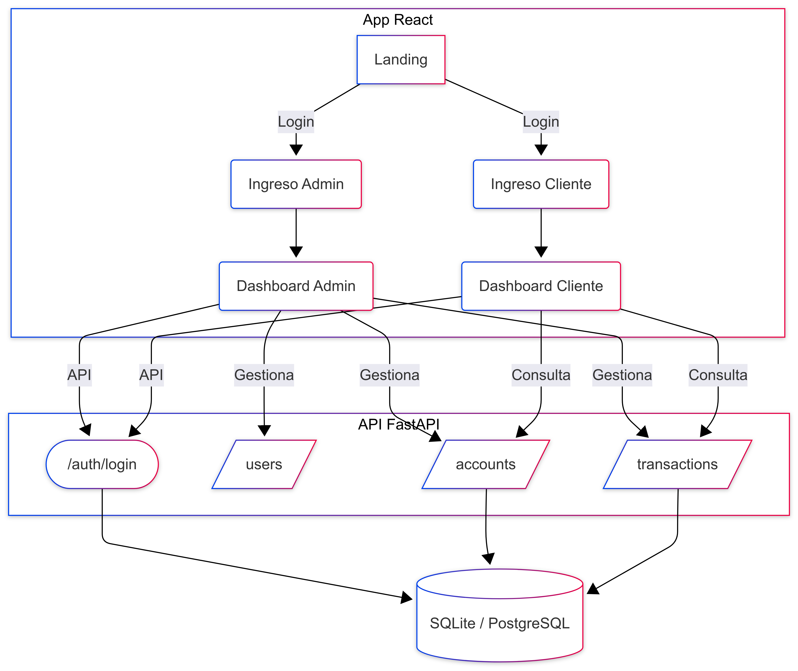
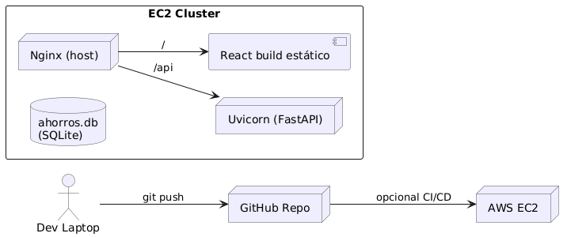
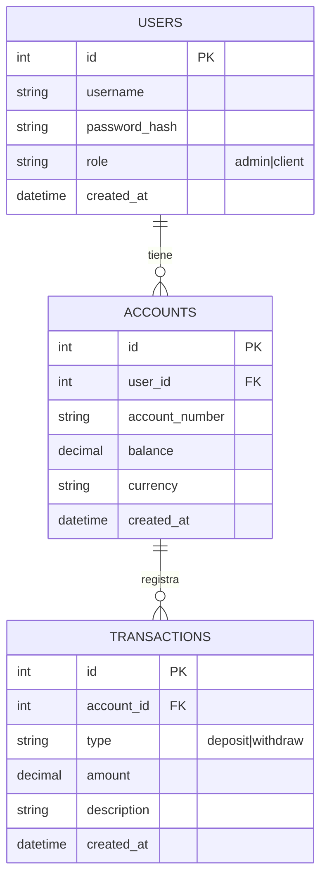

# Aplicación de Ahorros Fintech – Guía rápida (Local, Pruebas y CI)

[](https://github.com/juancjaramillo/Ahorros_Fintech/actions/workflows/backend.yml)
[](https://github.com/juancjaramillo/Ahorros_Fintech/actions/workflows/frontend.yml)

> **Qué es:** App para ver y mover ahorros. Dos piezas: **Frontend (React)** y **Backend (FastAPI)**.  
> **Objetivo:** que funcione localmente y en internet (AWS) y que **se pueda actualizar fácil** (“redeploy”).

---

## Índice
- [Visión general](#visión-general)
- [Arquitectura](#arquitectura)
  - [Diagrama de alto nivel](#diagrama-de-alto-nivel)
  - [Diagrama de despliegue](#diagrama-de-despliegue)
- [Estructura del proyecto](#estructura-del-proyecto)
- [Diseño de base de datos](#diseño-de-base-de-datos)
  - [ERD](#erd)
  - [DDL de referencia](#ddl-de-referencia)
- [API (endpoints principales)](#api-endpoints-principales)
- [Variables de entorno](#variables-de-entorno)
- [Instalación y desarrollo local](#instalación-y-desarrollo-local)
  - [Backend (FastAPI)](#backend-fastapi)
  - [Frontend (React)](#frontend-react)
  - [Datos (seed)](#semillas-de-datos-seed)
- [Pruebas locales](#pruebas-locales)
  - [Tests del Backend](#tests-del-backend)
  - [Tests del Frontend](#tests-del-frontend)
- [Despliegue en AWS](#despliegue-en-aws)
  - [Modo A · Manual](#modo-a--manual)
  - [Modo B · Docker Compose (rápido)](#modo-b--docker-compose-rápido)
- [CI/CD (GitHub Actions)](#cicd-github-actions)
- [Redeploy (actualizar versión rápido)](#redeploy-actualizar-versión-rápido)
- [Solución de problemas](#solución-de-problemas)
- [Capturas](#capturas)
- [Licencia](#licencia)

---

## Visión general
La aplicación permite **crear cuentas de ahorro**, **depositar**, **retirar** y **consultar movimientos**.  
- **Admin:** gestiona usuarios y cuentas; ve todas las transacciones.  
- **Cliente:** ve sus cuentas y movimientos; puede depositar/retirar en sus cuentas.

---

## Arquitectura

### Diagrama de alto nivel
> *No modifiques ni elimines las imágenes; se asume que existen en `docs/screenshots/`.*



### Diagrama de despliegue


---

## Estructura del proyecto

```
Ahorros_Fintech/
├─ backend/
│  ├─ main.py
│  ├─ routers/
│  │  ├─ account.py
│  │  ├─ user.py
│  │  └─ transaction.py
│  ├─ models.py
│  ├─ db.py
│  ├─ seed.py
│  ├─ requirements.txt
│  └─ .env
├─ frontend/
│  ├─ src/
│  │  ├─ api.js
│  │  ├─ components/
│  │  │  ├─ AdminLogin.js
│  │  │  ├─ ClientLogin.js
│  │  │  └─ ...
│  │  └─ ...
│  ├─ package.json
│  ├─ .env.development
│  └─ .env.production
├─ docker-compose.yml
└─ README.md
```

---

## Diseño de base de datos

### ERD


### DDL de referencia
> Esquema compatible con SQLite/Postgres (ajusta tipos según motor).

```sql
CREATE TABLE users (
  id INTEGER PRIMARY KEY AUTOINCREMENT,
  username TEXT NOT NULL UNIQUE,
  password_hash TEXT NOT NULL,
  role TEXT NOT NULL CHECK(role IN ('admin','client')),
  created_at DATETIME DEFAULT CURRENT_TIMESTAMP
);

CREATE TABLE accounts (
  id INTEGER PRIMARY KEY AUTOINCREMENT,
  user_id INTEGER NOT NULL,
  account_number TEXT NOT NULL UNIQUE,
  balance NUMERIC NOT NULL DEFAULT 0,
  currency TEXT NOT NULL DEFAULT 'COP',
  created_at DATETIME DEFAULT CURRENT_TIMESTAMP
);

CREATE TABLE transactions (
  id INTEGER PRIMARY KEY AUTOINCREMENT,
  account_id INTEGER NOT NULL,
  type TEXT NOT NULL CHECK(type IN ('deposit','withdraw')),
  amount NUMERIC NOT NULL CHECK(amount >= 0),
  description TEXT,
  created_at DATETIME DEFAULT CURRENT_TIMESTAMP
);
```

---

## API (endpoints principales)

| Método | Ruta | Descripción | Rol |
|---|---|---|---|
| POST | `/auth/login` | Autenticación (token) | Todos |
| POST | `/admin/login` | Login de administrador | Admin |
| GET  | `/users` | Lista usuarios | Admin |
| POST | `/users` | Crea usuario | Admin |
| GET  | `/accounts` | Lista cuentas (admin filtra por `user_id`; cliente ve las propias) | Admin/Cliente |
| POST | `/accounts` | Crea cuenta | Admin |
| GET  | `/transactions/by-account/{account_id}` | Movimientos de una cuenta | Admin/Cliente |
| POST | `/transactions/deposit` | Depósito | Admin/Cliente |
| POST | `/transactions/withdraw` | Retiro | Admin/Cliente |

**Usuarios de ejemplo (seed):**
- Admin: `admin` / `admin123`
- Cliente: `client1` / `client123`

---

## Variables de entorno

**Backend (`backend/.env`):**
```ini
# SQLite (ruta absoluta recomendada en producción/EC2)
DATABASE_URL=sqlite:////home/ubuntu/Ahorros_Fintech/ahorros.db
# Para desarrollo local también puedes usar:
# DATABASE_URL=sqlite:///./ahorros.db

SECRET_KEY=tu_llave_segura
ALGORITHM=HS256
ACCESS_TOKEN_EXPIRE_MINUTES=60
```

**Frontend:**
```
frontend/.env.development
REACT_APP_API_URL=http://localhost:8000/api

frontend/.env.production
REACT_APP_API_URL=/api
```

> Si cambias `.env.development`, reinicia `npm start` para que tome los valores.

---

## Instalación y desarrollo local

### Backend (FastAPI)

```bash
cd backend
python -m venv venv
# Linux/Mac
source venv/bin/activate
# Windows PowerShell
# .\venv\Scripts\Activate.ps1

pip install --upgrade pip
pip install -r requirements.txt

# Variables de entorno (crear backend/.env si no existe)
# DATABASE_URL=sqlite:///./ahorros.db
# SECRET_KEY=tu_llave_segura

# Ejecutar en modo desarrollo
uvicorn main:app --reload --host 0.0.0.0 --port 8000
```

### Frontend (React)

```bash
cd frontend
npm install
# Asegúrate de tener .env.development con REACT_APP_API_URL=http://localhost:8000/api
npm start   # abre http://localhost:3000
```

### Datos (seed)

```bash
# Estando en backend con el venv activado
python seed.py
```
Crea usuarios y datos mínimos para probar (admin/cliente).

---

## Pruebas locales

### Tests del Backend
Los workflows de CI instalan `requirements.txt` y, si existe, `requirements-dev.txt`. Localmente puedes replicarlo:

```bash
cd backend
source venv/bin/activate  # o .\venv\Scripts\Activate.ps1 en Windows
pip install -r requirements.txt
# opcional si existe:
# pip install -r requirements-dev.txt

# Ejecutar pruebas
pytest -q
# o con reporte de cobertura si está configurado:
# pytest --maxfail=1 --disable-warnings -q --cov=.
```

**Notas:**
- Si tus tests usan la base de datos, apunta `DATABASE_URL` a un archivo temporal/`sqlite:///:memory:` según tu configuración de pruebas.
- Si hay fixtures de seed, ejecútalas antes o usa factories dentro de pytest.

### Tests del Frontend

```bash
cd frontend
npm install
# Ejecutar pruebas sin modo watch
npm test -- --watchAll=false --coverage
# para desarrollo interactivo
npm test
```

---

## Despliegue en AWS

> La IP pública de EC2 cambia al reiniciar. Usa **Elastic IP** para que no cambie.

### Modo A · Manual

1) **Backend en EC2**
```bash
sudo apt update
sudo apt install -y python3-venv python3-pip git nginx sqlite3
git clone https://github.com/juancjaramillo/Ahorros_Fintech.git
cd Ahorros_Fintech/backend
python3 -m venv venv && source venv/bin/activate
pip install --upgrade pip && pip install -r requirements.txt
echo "DATABASE_URL=sqlite:////home/ubuntu/Ahorros_Fintech/ahorros.db" > .env
echo "SECRET_KEY=TU_LLAVE" >> .env
python seed.py
deactivate
```

2) **Servicio Uvicorn (systemd)**
```ini
# /etc/systemd/system/uvicorn.service
[Unit]
Description=FastAPI (Uvicorn)
After=network.target

[Service]
User=ubuntu
WorkingDirectory=/home/ubuntu/Ahorros_Fintech/backend
Environment="DATABASE_URL=sqlite:////home/ubuntu/Ahorros_Fintech/ahorros.db"
Environment="SECRET_KEY=TU_LLAVE"
ExecStart=/home/ubuntu/Ahorros_Fintech/backend/venv/bin/uvicorn main:app --host 0.0.0.0 --port 8000
Restart=always
RestartSec=3

[Install]
WantedBy=multi-user.target
```
```bash
sudo systemctl daemon-reload
sudo systemctl enable --now uvicorn
sudo systemctl status uvicorn --no-pager
```

3) **Frontend y Nginx (host)**
```bash
cd ~/Ahorros_Fintech/frontend
npm install && npm run build
sudo chown -R ubuntu:www-data build && sudo chmod -R 755 build
```
```nginx
# /etc/nginx/sites-available/ahorro
server {
    listen 80 default_server;
    server_name _;

    root /home/ubuntu/Ahorros_Fintech/frontend/build;
    index index.html;

    # API → FastAPI
    location /api/ {
        proxy_pass http://127.0.0.1:8000/;
        proxy_set_header Host $host;
        proxy_set_header X-Real-IP $remote_addr;
        proxy_set_header X-Forwarded-For $proxy_add_x_forwarded_for;
    }

    # Swagger / Redoc
    location /api/docs  { proxy_pass http://127.0.0.1:8000/docs; }
    location /api/redoc { proxy_pass http://127.0.0.1:8000/redoc; }

    # React SPA
    location / {
        try_files $uri $uri/ /index.html;
    }
}
```
```bash
sudo ln -sf /etc/nginx/sites-available/ahorro /etc/nginx/sites-enabled/ahorro
sudo rm -f /etc/nginx/sites-enabled/default
sudo nginx -t && sudo systemctl restart nginx
```

### Modo B · Docker Compose (rápido)

```yaml
# docker-compose.yml (raíz)
version: "3.9"
services:
  api:
    build:
      context: .
      dockerfile: backend/Dockerfile
    container_name: fastapi
    restart: always
    volumes:
      - /home/ubuntu/Ahorros_Fintech/ahorros.db:/data/ahorros.db
    networks: [ web ]

  web:
    build:
      context: .
      dockerfile: frontend/Dockerfile
    container_name: react-nginx
    restart: always
    ports:
      - "80:80"
    depends_on: [ api ]
    networks: [ web ]

networks:
  web:
```

---

## CI/CD (GitHub Actions)

- **Backend CI** (`.github/workflows/backend.yml`):  
  - Se dispara en `push`/`pull_request` que toquen `backend/**` o el propio workflow.  
  - Usa Python 3.11, cache de pip, instala `requirements.txt` y opcionalmente `requirements-dev.txt`.  
  - Ejecuta `pytest` si hay configuración (`pytest.ini` o `pyproject.toml`).

- **Frontend CI** (`.github/workflows/frontend.yml`):  
  - Se dispara en `push`/`pull_request` que toquen `frontend/**` o el workflow.  
  - Usa Node 20, cache de npm, `npm ci`, ejecuta `npm test -- --watchAll=false --coverage` y hace `npm run build` si pasan las pruebas.  
  - Sube el artefacto `frontend-build` (carpeta `frontend/build`).

> Los badges al inicio de este README muestran el estado de CI para `main`.

---

## Redeploy (actualizar versión rápido)

- **Docker:**  
```bash
git pull
docker compose up -d --build
```

- **Manual:**  
```bash
# backend
cd backend && source venv/bin/activate
pip install -r requirements.txt
deactivate && sudo systemctl restart uvicorn

# frontend
cd ../frontend && npm install && npm run build
sudo systemctl restart nginx
```

**Demostración:** cambia un texto visible en el frontend, `git push` y aplica los comandos. Al refrescar el sitio en el navegador se ve el cambio.

---

## Solución de problemas

- **502 Bad Gateway (Nginx → Uvicorn):**
  ```bash
  sudo systemctl status uvicorn
  sudo journalctl -u uvicorn -n 100 --no-pager
  ```
- **No carga el sitio (frontend):**
  ```bash
  sudo systemctl status nginx
  sudo nginx -t
  ```
- **Conflicto de puerto 80:** apaga Docker o Nginx del host (no ambos a la vez).  
- **CORS en desarrollo:** usa `REACT_APP_API_URL=http://localhost:8000/api` y habilita CORS en el backend si es necesario.

---

## Capturas

- **Dashboard Admin**  
  

- **Dashboard Cliente**  
  

---

## Licencia
Uso para prueba técnica (Licencia MIT).
